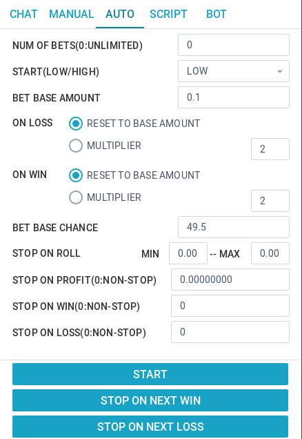

__[Back to Home Page](/)__

# Auto Tutorials

## Auto Bet UI

## Functions
* NUM OF BETS (0: UNLIMITED): The number of bets you wish to bet in a cycle. The default value of it is 0, it means unlimited bets in a cycle unless you stop it or your balance is not enough to bet.
* START (LOW/HIGH): The flag indicates low or high you wish the bet in a cycle.
* BET BASE AMOUNT: The initial bet base amount.
* ON LOSS:
	* RESET TO BASE AMOUNT: Once the bet is LOSS, then reset next bet amount to base amount.
	* MULTIPLIER: Once the bet is LOSS, then let 'next bet amount' =  'current bet amount' x  'multiplier'.
* ON WIN:
	* RESET TO BASE AMOUNT: Once the bet is WIN, then reset next bet amount to base amount.
	* MULTIPLIER: Once the bet is WIN, then let 'next bet amount' =  'current bet amount' *  'multiplier'.
* BET BASE CHANCE: The initial bet amount in a cycle.
* STOP ON ROLL:
	* MIN: The minimal roll number.
	* MAX: The maximum roll number.
* STOP ON PROFIT (0:NON-STOP): When profit reach this value setting, then stop; Default value of 0 means non-stop.
* STOP ON WIN (0:NON-STOP): When count of wins reach this value setting, then stop; Default value of 0 means non-stop.
* STOP ON LOSS (0:NON-STOP): When count of loss reach this value setting, then stop; Default value of 0 means non-stop.
* START: Start auto bet.
* STOP ON NEXT WIN: If next bet result is WIN, then stop.
* STOP ON NEXT LOSS: If next bet result is LOSS, then stop.