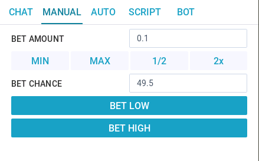

__[Back to Home Page](/)__

# Manual Tutorials

## Manual Bet UI

## Functions
* BET AMOUNT - The amount you will bet each time (Usually the minimal amoun is 0.00000001).
* MIN, MAX, 1/2, 2x - They are shortcut to set the BET AMOUNT based on your balance.
* BET CHANCE - The chance you will bet each time (Different sites may have different chance range)
* BET LOW - Betting the next number is lower than the next rolled number which will be generated from dice site.
* BET HIGH - Betting the next number is higher than the next rolled roll number which will be generated from dice site.

