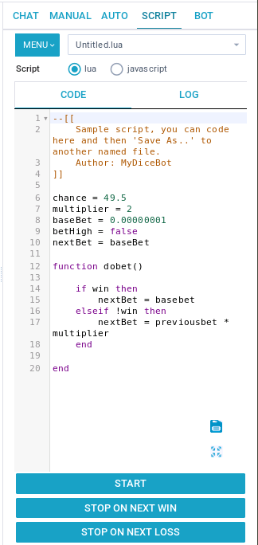

__[Back to Home Page](/)__

# Script Tutorials

## Script Bet UI



## Functions
* MENU:
	* Import: Import the script from your local machine.
	* Save: Save current script.
	* Save As..: Save current script in another file name.
	* Delete: Delete current script.
* Script Drop-down List: Select script in the list.
* Programming Language Selection
	* lua: Lua programming language.
	* javascript: Javascript programming language.
* CODE: Edit Lua/Javascript source code here.
* LOG: Debug log of running the script.
* Floating Save Button: Easy to save script in Full-Screen Mode.
* Floating Full-Screen/Original-Screen Button: Adjust code edit UI to Full-Screen or Original-Screen.
* START: Start script bet.
* STOP ON NEXT WIN: If next bet result is WIN, then stop.
* STOP ON NEXT LOSS: If next bet result is LOSS, then stop.

## Internal Variables
* __Single Bet Info__

|Variable|Type|Permission|Purpose|
|---|---|---|---|
|__basebet__|double|Read Write|Shows the amount of the first bet. Only set for first bet.|
|__previousbet__|double|Read Only|Shows the amount of the previous bet. Only set after first bet.|
|__nextbet__|double|Read Write|The amount to bet in the next bet. You need to assign a value to this variable to change the amount bet. Defaults to previousbet after first bet. Needs to be set before betting can start.|
|__chance__|double|Read Write|The chance to win when betting. Defaults to value set in advanced settings if not set. Need to set this value to change the chance to win/payout when betting.|
|__bethigh__|bool|Read Write|Whether to bet high/over (true) or low/under(false). Defaults to true (bet high/bet over)|
|__win__|bool|Read Only|Indicates whether the last bet you made was a winning bet (true) or a losing bet (false).|
|__currentprofit__|double|Read Only|Shows the profit for the last bet made. This is not the amount returned. betting 1 unit at x2 payout, when winning, currentprofit will show 0.00000001 (returned =0.00000002), when losing, profit will show -0.00000001|

* __Current Session Info__

|Variable|Type|Permission|Purpose|
|---|---|---|---|
|__balance__|double|Read Only|Lists your balance at the site you're logged in to.|
|__bets__|int|Read Only|Shows the number of bets for the current session.|
|__wins__|int|Read Only|Shows the number of wins for the current session.|
|__losses__|int|Read Only|Shows the number of losses for the current session.|
|__profit__|double|Read Only|Shows your session profit. Session is defined as the time since opening the current instance of bot or the last time you reset your stats in the bot.|
|__currentstreak__|double|Read Only|Shows the current winning or losing streak. When positive (>0), it's a winning streak. When negative (<0) it's a losing streak. Can never be 0. Only set after first bet.|
|__currentroll__|double|Read Only|Show current roll information|

## Internal Functions

|Function|Purpose|
|---|---|
|__dobet()__|The loop of bets|
|__stop()__|Stop the bet|

## Sample Code
* Strategy: Basic Martingale
* Using Lua
```lua
chance = 49.5
multiplier = 2
basebet = 0.00000010
bethigh = false

function dobet()
    if profit >= 0.1 then
        stop()
    end
    
    if win then
        nextbet = basebet
    else
        nextbet = previousbet * multiplier
    end
end
```
* Using Javascript
```javascript
chance = 49.5;
multiplier = 2;
baseBet = 0.00000001;
betHigh = false;

function dobet() {
    if (win) {
        nextBet = basebet;
    } else {
        nextBet = previousbet * multiplier;
    }
}
```